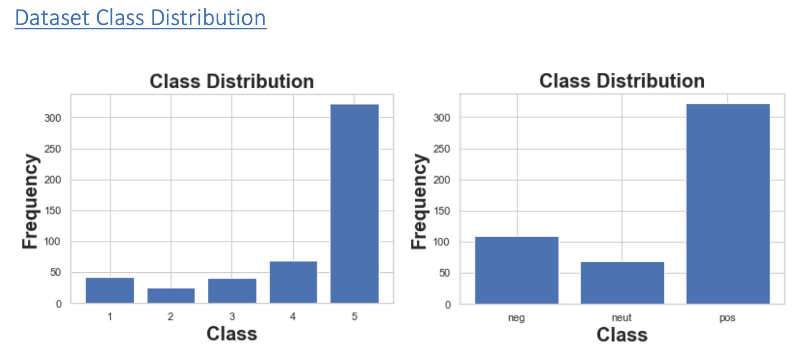
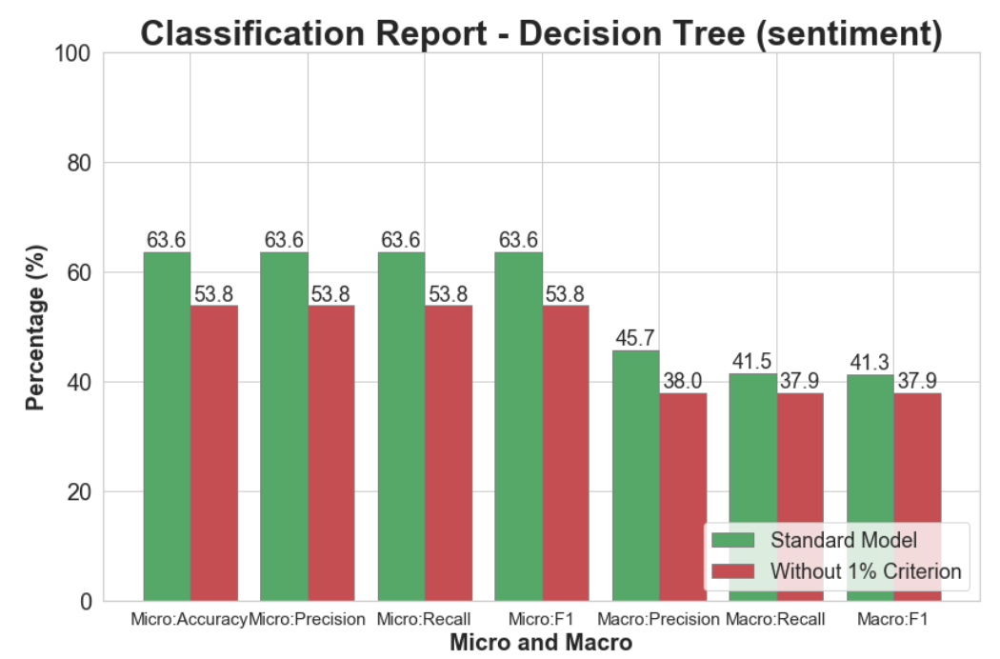

# ML_NLP

## MIT assignment: Rating Prediction (Supervised Learning)

- This university assignment was completed by myself
- Using ML + NLTK toolkit to perform language analysis based on Amazon customer reviews (reviews.tsv)
- Several models were used, and tuned according to assignment requirements - BNB, DT, MNB
- Tuned based on several language parameters (uppercase/lowercase, PorterStemming, stop_words, count_vectorizer, token pattern, etc)

- Dataset in reviews.tsv

Example raw data:

``this ia a good idea; however, difficult to open.  must squeeze/twist pretty hard & product oozes free - usually all over fingers.  also, portion size is a bit too small.  still love agave.
``

  

  
  

